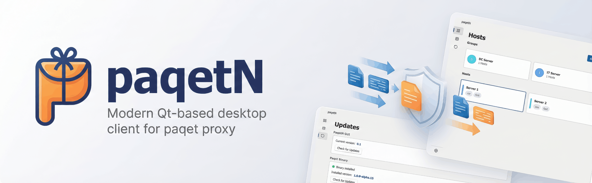

# paqetN

<div align="center">


[](LICENSE)
[](https://www.qt.io/)
[](https://github.com/AliRezaBeigy/paqetN)
[](https://github.com/AliRezaBeigy/paqetN/actions)

[Features](#features) • [Installation](#installation) • [Building](#building) • [Documentation](#documentation) • [Contributing](#contributing)

</div>

---

## Overview

paqetN is a feature-rich desktop application for managing [paqet](https://github.com/hanselime/paqet) proxy configurations. Built with Qt 6 and QML, it provides an intuitive Microsoft Fluent Design interface for configuring, connecting, and monitoring your packet-level proxy connections.

The application runs paqet in **SOCKS-only mode**, allowing you to easily route your browser or system traffic through `127.0.0.1:<port>`.

## Features

### Core Functionality
- **Configuration Management**: Add, edit, delete, and organize proxy configurations
- **Quick Connect**: One-click connection to any saved profile
- **Real-time Monitoring**: Live log viewer showing paqet stdout/stderr
- **Latency Testing**: Test proxy connection speed before connecting
- **Import/Export**: Support for `paqet://` URLs, JSON, and YAML formats

### Advanced Features
- **Auto-Update System**: Automatic updates for both paqetN and paqet binary
- **Group Organization**: Organize configs into collapsible groups
- **Clipboard Integration**: Quick import from clipboard
- **File Import/Export**: Import configs from files or export for backup
- **Theme Support**: Dark, Light, and System theme modes
- **Single Instance Guard**: Prevents multiple instances running simultaneously
- **High-DPI Support**: Crisp UI on high-resolution displays

### User Interface
- **Microsoft Fluent Design**: Modern, polished UI using FluentUI framework
- **Card-Based Layout**: Intuitive grid view for configuration browsing
- **Detail Panel**: Quick access to config details and actions
- **Settings Page**: Centralized configuration for app preferences
- **Log Management**: Word wrap, export, copy, and clear log functionality

## Installation

### Pre-built Binaries

Download the latest release for your platform from the [Releases](https://github.com/AliRezaBeigy/paqetN/releases) page.

#### Windows
1. Download `paqetN-windows-x64.zip`
2. Extract and run `apppaqetN.exe`
3. Ensure `paqet.exe` is in the same directory or in your PATH

#### Linux
```bash
# Download and extract
wget https://github.com/AliRezaBeigy/paqetN/releases/latest/download/paqetN-linux-x64.tar.gz
tar -xzf paqetN-linux-x64.tar.gz

# Run
./apppaqetN
```

#### macOS
```bash
# Download and mount DMG
# Drag paqetN.app to Applications folder
```

### paqet Binary Requirement

paqetN requires the `paqet` proxy binary to function. The application can automatically download it for you:
1. **Auto-Download (Recommended)**: Navigate to **Updates** page and click "Download & Install" for paqet
2. **Manual Download**: Get pre-built binaries from [paqet releases](https://github.com/hanselime/paqet/releases)
3. **Build from source**: See [docs/BUILDING.md](docs/BUILDING.md#building-paqet-binary)
4. **Configure path**: Set custom paqet binary path in Settings

## Building

### Quick Start

```bash
# Clone repository with submodules
git clone --recursive https://github.com/AliRezaBeigy/paqetN.git
cd paqetN

# Configure (adjust Qt path as needed)
export CMAKE_PREFIX_PATH=/path/to/Qt/6.8/gcc_64
cmake -B build

# Build
cmake --build build

# Run
./build/apppaqetN
```

### Detailed Instructions

See [docs/BUILDING.md](docs/BUILDING.md) for comprehensive build instructions including:
- Platform-specific requirements
- Qt installation and configuration
- Compiler setup (especially Windows/MinGW)
- Building paqet from source
- Running tests
- Deployment and packaging

## Usage

### Getting Started

1. **Launch paqetN**: Run the application executable
2. **Add a Configuration**:
   - Click **Add** button or **Import from Clipboard**
   - Paste a `paqet://...` URL or enter details manually
   - Click **Add** to save
3. **Connect to Proxy**:
   - Select a configuration from the grid
   - Click **Connect** in the detail panel
   - Configure your browser/system to use SOCKS5 proxy: `127.0.0.1:<port>`
4. **Monitor Connection**:
   - View real-time logs in the **Logs** page
   - Test latency using the **Test** button
5. **Disconnect**: Click **Disconnect** to stop the proxy

### Settings

Access settings via the **Settings** navigation item:

- **Theme**: Dark, Light, or System (follows OS theme)
- **SOCKS Port**: Default local port for proxy (default: 1284)
- **Connection Check URL**: URL for latency testing
- **Log Level**: Debug, Info, Warn, or Error
- **paqet Binary Path**: Custom path to paqet executable (optional)

### Data Storage

- **Configurations**: Stored in `configs.json` at:
  - Windows: `%APPDATA%/paqetN/configs.json`
  - Linux: `~/.local/share/paqetN/configs.json`
  - macOS: `~/Library/Application Support/paqetN/configs.json`
- **Settings**: Platform-specific (QSettings):
  - Windows: Registry or INI file
  - Linux: `~/.config/paqetN/paqetN.conf`
  - macOS: `~/Library/Preferences/paqetN.plist`

## Documentation

- **[Building from Source](docs/BUILDING.md)**: Detailed build instructions
- **[Architecture](docs/ARCHITECTURE.md)**: Technical architecture and design
- **[Development Guide](docs/DEVELOPMENT.md)**: Development workflow and tips
- **[Contributing Guidelines](CONTRIBUTING.md)**: How to contribute to the project

## Development

### Prerequisites

- Qt 6.8+ (Quick, Network, Widgets, Svg, PrintSupport modules)
- CMake 3.20+
- C++17 compiler (GCC 9+, Clang 10+, MSVC 2019+, or MinGW 13.1+)

### Project Structure

```
paqetN/
├── .github/          # GitHub workflows and templates
├── 3rdparty/         # FluentUI dependency
├── docs/             # Documentation
├── qml/              # QML UI files
│   ├── components/   # Reusable UI components
│   ├── dialogs/      # Dialog windows
│   ├── pages/        # Main pages
│   └── Main.qml      # Root window
├── scripts/          # Build scripts
├── src/              # C++ source files
├── tests/            # Unit and UI tests
└── CMakeLists.txt    # CMake configuration
```

### Running Tests

```bash
cd build
ctest -V

# Or run directly with verbose output
./tst_paqetn -v2
```

Tests cover:
- Configuration parsing and serialization
- Repository CRUD operations
- Log buffer management
- Qt model interface
- Controller orchestration
- UI smoke tests

### Contributing

We welcome contributions! Please see [CONTRIBUTING.md](CONTRIBUTING.md) for:
- Code of conduct
- Development setup
- Coding standards
- Testing guidelines
- Pull request process

## Technology Stack

- **[Qt 6](https://www.qt.io/)**: Cross-platform application framework
- **[QML](https://doc.qt.io/qt-6/qmlapplications.html)**: Declarative UI
- **[FluentUI](https://github.com/zhuzichu520/FluentUI)**: Microsoft Fluent Design System for Qt
- **[QuaZip](https://github.com/stachenov/quazip)**: Qt/C++ wrapper for ZIP/UNZIP
- **[CMake](https://cmake.org/)**: Build system
- **C++17**: Backend implementation
- **[Qt Test](https://doc.qt.io/qt-6/qtest-overview.html)**: Testing framework

## License

This project is licensed under the MIT License - see the [LICENSE](LICENSE) file for details.

## Acknowledgments

- [paqet](https://github.com/hanselime/paqet) - The packet-level proxy this client manages
- [FluentUI](https://github.com/zhuzichu520/FluentUI) - Fluent Design System for Qt
- [QuaZip](https://github.com/stachenov/quazip) - Qt wrapper for ZIP archives
- [Qt Project](https://www.qt.io/) - Cross-platform application framework

## Support

- **Issues**: [GitHub Issues](https://github.com/AliRezaBeigy/paqetN/issues)
- **Discussions**: [GitHub Discussions](https://github.com/AliRezaBeigy/paqetN/discussions)
- **Documentation**: [docs/](docs/) directory

---

<div align="center">

Made with ❤️ using Qt and FluentUI

[Report Bug](https://github.com/AliRezaBeigy/paqetN/issues) · [Request Feature](https://github.com/AliRezaBeigy/paqetN/issues) · [Documentation](docs/)

</div>
